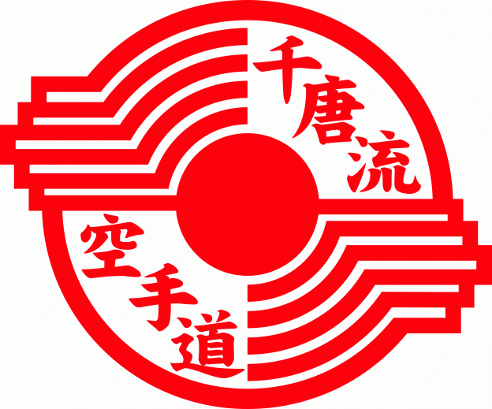

# SEO Optimization Guide for Northern Rockies PG Chito-Ryu Karate Club

## Overview

This document provides comprehensive SEO strategies specifically tailored for the Northern Rockies PG Chito-Ryu Karate Club website to improve visibility for "martial arts Prince George" searches and related local queries.

## Current SEO Status Assessment

### Strengths
- Clean, semantic HTML5 structure
- Bootstrap framework for responsive design
- Well-organized content with clear navigation
- Strong local relevance (Prince George, BC)
- Quality content with FAQ section

### Issues to Address
- Missing meta descriptions on most pages
- Duplicate meta description tags in index.html
- Invalid HTML structure (h3 inside p tags)
- Old Google Analytics UA- format instead of GA4 G-
- No structured data markup
- Missing Open Graph tags
- No XML sitemap
- No robots.txt file
- Slow page loading (unoptimized images)
- Navigation text-white on white background
- No active state styling for current page

## Phase 1: Technical SEO Foundation

### 1.1 HTML Structure & Validation

**Fix Critical HTML Issues:**
```html
<!-- index.html: Fix invalid structure -->
<div class="text-center">
    <h1 class="display-4">Welcome to Northern Rockies PG Chito-Ryu Karate Club</h1>
    
    <p class="lead">
        Traditional Karate for Kids and Adults in Prince George...
    </p>
    
    <h2>Why Families Choose Our Dojo</h2>
    <p>At PG Chito-Ryu, we teach traditional karate...</p>
    
    <h3>Youth Karate (Ages 8–14)</h3>
    <p>As children grow, karate becomes a powerful tool...</p>
    
    <h3>Teen and Adult Karate (Ages 15+)</h3>
    <p>For Teens and Adults karate offers lifelong fitness...</p>
</div>
```

**Remove Duplicate Meta Tags:**
```html
<!-- Keep only one meta description -->
<meta name="description" content="Traditional Chito-Ryu karate classes for kids and adults in Prince George. Build confidence, discipline, and lifelong strength through traditional karate training in a safe and respectful dojo environment.">
```

### 1.2 Meta Tags & SEO Elements

**Add Comprehensive Meta Tags to All Pages:**
```html
<head>
    <meta charset="utf-8" />
    <meta name="viewport" content="width=device-width, initial-scale=1.0" />
    
    <!-- Primary Meta Tags -->
    <title>Martial Arts Prince George | Chito-Ryu Karate Classes | Northern Rockies</title>
    <meta name="description" content="Traditional Chito-Ryu karate classes for kids and adults in Prince George. Build confidence, discipline, and lifelong strength. Call (250) 640-1099 for free trial!">
    <meta name="keywords" content="martial arts, karate, Chito-Ryu, Prince George, kids karate, adult karate, self-defense, traditional karate">
    <meta name="author" content="Northern Rockies PG Chito-Ryu Karate Club">
    
    <!-- Open Graph / Facebook -->
    <meta property="og:type" content="website" />
    <meta property="og:url" content="https://pgchitoryu.com/" />
    <meta property="og:title" content="Martial Arts Prince George | Chito-Ryu Karate Classes" />
    <meta property="og:description" content="Traditional Chito-Ryu karate classes for kids and adults in Prince George. Build confidence, discipline, and lifelong strength." />
    <meta property="og:image" content="https://pgchitoryu.com/images/crestred.gif" />
    
    <!-- Twitter -->
    <meta property="twitter:card" content="summary_large_image" />
    <meta property="twitter:url" content="https://pgchitoryu.com/" />
    <meta property="twitter:title" content="Martial Arts Prince George | Chito-Ryu Karate Classes" />
    <meta property="twitter:description" content="Traditional Chito-Ryu karate classes for kids and adults in Prince George." />
    <meta property="twitter:image" content="https://pgchitoryu.com/images/crestred.gif" />
    
    <!-- Google Analytics 4 -->
    <script async src="https://www.googletagmanager.com/gtag/js?id=G-XXXXXXXXXX"></script>
    <script>
        window.dataLayer = window.dataLayer || [];
        function gtag(){dataLayer.push(arguments);}
        gtag('js', new Date());
        gtag('config', 'G-XXXXXXXXXX');
    </script>
</head>
```

### 1.3 Structured Data Implementation

**Add LocalBusiness Schema Markup:**
```html
<script type="application/ld+json">
{
  "@context": "https://schema.org",
  "@type": "LocalBusiness",
  "name": "Northern Rockies PG Chito-Ryu Karate Club",
  "image": "https://pgchitoryu.com/images/crestred.gif",
  "@id": "https://pgchitoryu.com/",
  "url": "https://pgchitoryu.com/",
  "telephone": "(250) 640-1099",
  "address": {
    "@type": "PostalAddress",
    "streetAddress": "180 Tabor Blvd S",
    "addressLocality": "Prince George",
    "addressRegion": "BC",
    "postalCode": "V2N 0B8",
    "addressCountry": "CA"
  },
  "geo": {
    "@type": "GeoCoordinates",
    "latitude": "53.9333",
    "longitude": "-122.7667"
  },
  "openingHours": [
    "Tu 18:30-21:00",
    "Th 18:30-21:00"
  ],
  "sameAs": [
    "https://www.facebook.com/princegeorgekarate"
  ]
}
</script>
```

### 1.4 XML Sitemap & Robots.txt

**Create sitemap.xml:**
```xml
<?xml version="1.0" encoding="UTF-8"?>
<urlset xmlns="http://www.sitemaps.org/schemas/sitemap/0.9">
    <url>
        <loc>https://pgchitoryu.com/</loc>
        <lastmod>2025-02-07</lastmod>
        <changefreq>weekly</changefreq>
        <priority>1.0</priority>
    </url>
    <url>
        <loc>https://pgchitoryu.com/about.html</loc>
        <lastmod>2025-02-07</lastmod>
        <changefreq>monthly</changefreq>
        <priority>0.8</priority>
    </url>
    <url>
        <loc>https://pgchitoryu.com/classes.html</loc>
        <lastmod>2025-02-07</lastmod>
        <changefreq>weekly</changefreq>
        <priority>0.9</priority>
    </url>
    <url>
        <loc>https://pgchitoryu.com/faq.html</loc>
        <lastmod>2025-02-07</lastmod>
        <changefreq>monthly</changefreq>
        <priority>0.7</priority>
    </url>
    <url>
        <loc>https://pgchitoryu.com/contact.html</loc>
        <lastmod>2025-02-07</lastmod>
        <changefreq>weekly</changefreq>
        <priority>0.8</priority>
    </url>
    <url>
        <loc>https://pgchitoryu.com/instructors.html</loc>
        <lastmod>2025-02-07</lastmod>
        <changefreq>monthly</changefreq>
        <priority>0.6</priority>
    </url>
</urlset>
```

**Create robots.txt:**
```
User-agent: *
Allow: /

Sitemap: https://pgchitoryu.com/sitemap.xml

# Block sensitive files
Disallow: /admin/
Disallow: /private/
Disallow: /config/

# Allow crawling of images
Allow: /images/
```

## Phase 2: Content Optimization

### 2.1 Keyword Research & Targeting

**Primary Keywords:**
- "martial arts Prince George"
- "karate classes Prince George"
- "karate school Prince George"
- "kids martial arts Prince George"
- "adult karate classes Prince George"
- "Chito-Ryu karate Prince George"
- "traditional karate Prince George"
- "self-defense classes Prince George"
- "family karate Prince George"
- "martial arts near me"

**Secondary Keywords:**
- "karate for beginners Prince George"
- "karate tournaments Prince George"
- "martial arts training Prince George"
- "karate belt ranking Prince George"
- "karate dojo Prince George"
- "kids self-defense Prince George"
- "adult martial arts Prince George"

### 2.2 Page-Specific Optimization

**Homepage (index.html):**
```html
<title>Martial Arts Prince George | Chito-Ryu Karate Classes | Northern Rockies</title>
<meta name="description" content="Traditional Chito-Ryu karate classes for kids and adults in Prince George. Build confidence, discipline, and lifelong strength. Call (250) 640-1099 for free trial!">

<h1 class="display-4">Welcome to Northern Rockies PG Chito-Ryu Karate Club</h1>
<p class="lead">Traditional Karate for Kids and Adults in Prince George. Build confidence, discipline, and lifelong strength through traditional karate training in a safe and respectful dojo environment.</p>

<h2>Why Families Choose Our Dojo</h2>
<p>At PG Chito-Ryu, we teach traditional karate the way it was meant to be learned — with structure, respect, and steady personal growth. Our classes are designed to help students of all ages develop both physical skills and strong character.</p>
```

**Classes Page (classes.html):**
```html
<title>Karate Classes Prince George | Adult & Kids Karate | Northern Rockies</title>
<meta name="description" content="Adult and kids karate classes in Prince George. Traditional Chito-Ryu karate with experienced instructors. Classes Tuesday & Thursday. Call (250) 640-1099 to join!">

<h1 class="text-center mb-4">Training Classes in Prince George</h1>
<h2>Class Schedule</h2>
<p>Join one of our training sessions</p>
<ul>
    <li>Kids classes: Tuesday & Thursday: 6:30 PM - 7:30 PM</li>
    <li>Adult classes: Tuesday & Thursday: 7:40 PM - 8:45 PM</li>
</ul>
```

**About Page (about.html):**
```html
<title>Chito-Ryu Karate Prince George | Traditional Martial Arts | Northern Rockies</title>
<meta name="description" content="Learn about Chito-Ryu karate in Prince George. Traditional martial arts with deep history and philosophy. Join our dojo for authentic training experience.">

<h1 class="text-center mb-4">About Chito-Ryu Karate</h1>
<h2>History</h2>
<p>Chito-Ryu Karate was founded by Dr. Tsuyoshi Chitose. O-Sensei studied various martial arts, developing Chito-Ryu by combining strengths and aspects of both Shuri-Te and Naha no Te with medical knowledge.</p>
```

### 2.3 Content Enhancement

**Add Location-Specific Content:**
- Mention Prince George landmarks
- Reference local events
- Include community involvement
- Add testimonials from local students

**Example Content Addition:**
```html
<!-- Add to homepage or about page -->
<div class="jumbotron">
    <h2>Serving Prince George Martial Arts Community</h2>
    <p>As a proud member of the Prince George martial arts community, we participate in local events and support community initiatives. Our dojo is conveniently located near [local landmark] and serves families throughout Prince George and surrounding areas.</p>
    <p>Join us for our annual [local event] demonstration and experience the power of traditional Chito-Ryu karate!</p>
</div>
```

## Phase 3: User Experience & Performance

### 3.1 Navigation & User Experience

**Fix Navigation Text Color:**
```css
/* Update in css/site.css */
.navbar-nav .nav-link {
    color: #c72727 !important;
    text-shadow: 1px 1px 2px rgba(0,0,0,0.5);
}

.navbar-nav .nav-link:hover {
    color: #fff !important;
}

/* Add active state styling */
.navbar-nav .nav-link.active {
    color: #fff !important;
    font-weight: bold;
    text-decoration: underline;
}
```

**Add Active State Detection:**
```javascript
// Add to js/site.js
$(document).ready(function() {
    // Add active class to current page
    var currentPage = window.location.pathname;
    $('.navbar-nav a').each(function() {
        if ($(this).attr('href') === currentPage.split('/').pop()) {
            $(this).addClass('active');
        }
    });
});
```

### 3.2 Performance Optimization

**Image Optimization:**
```html
<!-- Optimize logo image -->


<!-- Add responsive images -->
<picture>
    <source srcset="images/crestred-sm.gif" media="(max-width: 576px)">
    <source srcset="images/crestred-md.gif" media="(max-width: 768px)">
    
</picture>
```

**CSS Optimization:**
```css
/* Add to css/site.css */
/* Optimize body background */
body {
    margin-bottom: 60px;
    background: linear-gradient(135deg,#000 0%,#222 50%,#000 100%);
    color: #fff;
    font-family: 'Arial',sans-serif;
    background-size: cover;
    background-attachment: fixed;
}

/* Optimize card backgrounds */
.card {
    background: rgba(0,0,0,0.9);
    border: 1px solid #800;
    color: #fff;
    transition: transform 0.3s ease, box-shadow 0.3s ease;
}

.card:hover {
    transform: translateY(-2px);
    box-shadow: 0 8px 25px rgba(200, 32, 32, 0.3);
}
```

## Phase 4: Local SEO & Citations

### 4.1 Google Business Profile Optimization

**Complete GBP Profile:**
- Business Name: Northern Rockies PG Chito-Ryu Karate Club
- Category: Martial Arts School
- Address: 180 Tabor Blvd S, Prince George, BC
- Phone: (250) 640-1099
- Website: https://pgchitoryu.com/
- Hours: Tu 18:30-21:00, Th 18:30-21:00
- Attributes: Wheelchair accessible, gender-neutral restrooms, etc.

**GBP Content Strategy:**
- Post weekly updates about classes, events
- Share student achievements
- Post photos of classes and events
- Respond to all reviews promptly
- Use relevant hashtags: #PrinceGeorgeKarate #ChitoRyu #MartialArts

### 4.2 Local Citations & Directory Listings

**Create Listings on:**
- Yellow Pages Canada
- Yelp Canada
- Facebook Business Page
- Bing Places
- CanadaOne Directory
- Local Prince George business directories
- Martial arts school directories

**Ensure NAP Consistency:**
- Name: Northern Rockies PG Chito-Ryu Karate Club
- Address: 180 Tabor Blvd S, Prince George, BC V2N 0B8
- Phone: (250) 640-1099
- Website: https://pgchitoryu.com/

## Phase 5: Content Marketing & Authority Building

### 5.1 Blog Content Strategy

**Create Targeted Blog Posts:**
1. "Benefits of Karate for Kids in Prince George"
2. "Traditional Chito-Ryu Karate vs Other Styles"
3. "Self-Defense Tips for Prince George Residents"
4. "Karate Tournament Preparation Guide"
5. "How Karate Builds Confidence in Children"
6. "Adult Karate Classes: Never Too Late to Start"
7. "Family Karate: Training Together in Prince George"
8. "The History and Philosophy of Chito-Ryu Karate"

**Content Optimization:**
```html
<!-- Example blog post structure -->
<article class="blog-post">
    <h2>Benefits of Karate for Kids in Prince George</h2>
    <p>Discover how karate classes can help your child develop confidence, discipline, and physical fitness right here in Prince George.</p>
    
    <h3>Physical Benefits</h3>
    <ul>
        <li>Improved coordination and balance</li>
        <li>Enhanced strength and flexibility</li>
        <li>Better cardiovascular health</li>
    </ul>
    
    <h3>Mental Benefits</h3>
    <ul>
        <li>Increased focus and concentration</li>
        <li>Better self-discipline and respect</li>
        <li>Improved confidence and self-esteem</li>
    </ul>
</article>
```

### 5.2 Video Content Optimization

**Create and Optimize Videos:**
- Class demonstrations
- Student testimonials
- Instructor interviews
- Event coverage
- Training tips

**Video SEO:**
```html
<!-- Embed videos with proper markup -->
<div class="video-container">
    <iframe src="https://www.youtube.com/embed/VIDEO_ID" 
            title="Karate Classes Prince George | Northern Rockies PG Chito-Ryu"
            loading="lazy"
            allow="accelerometer; autoplay; clipboard-write; encrypted-media; gyroscope; picture-in-picture"
            allowfullscreen>
    </iframe>
</div>

<!-- Add video schema -->
<script type="application/ld+json">
{
  "@context": "https://schema.org",
  "@type": "VideoObject",
  "name": "Karate Classes in Prince George",
  "description": "Watch our karate classes in action at Northern Rockies PG Chito-Ryu in Prince George",
  "thumbnailUrl": "https://pgchitoryu.com/images/video-thumbnail.jpg",
  "contentUrl": "https://www.youtube.com/watch?v=VIDEO_ID",
  "uploadDate": "2025-02-07",
  "duration": "PT5M",
  "publisher": {
    "@type": "Organization",
    "name": "Northern Rockies PG Chito-Ryu Karate Club"
  }
}
</script>
```

## Phase 6: Monitoring & Analytics

### 6.1 Google Search Console Setup

**Verify and Configure:**
- Submit XML sitemap
- Monitor search performance
- Check for crawl errors
- Monitor mobile usability
- Track keyword rankings

### 6.2 Google Analytics 4 Setup

**Configure GA4:**
- Track page views and events
- Set up conversion tracking
- Monitor user behavior
- Track form submissions
- Monitor traffic sources

### 6.3 Performance Monitoring

**Track Key Metrics:**
- Organic search traffic
- Keyword rankings
- Click-through rates
- Conversion rates
- Page loading speed
- Mobile usability

## Implementation Timeline

### Week 1: Technical Foundation
- [ ] Fix HTML validation errors
- [ ] Add meta descriptions to all pages
- [ ] Implement structured data
- [ ] Create XML sitemap and robots.txt
- [ ] Set up Google Analytics 4

### Week 2: Content Optimization
- [ ] Optimize title tags with location keywords
- [ ] Add Open Graph tags
- [ ] Implement active state navigation
- [ ] Optimize images and performance
- [ ] Create GBP profile

### Week 3: Local SEO
- [ ] Complete GBP profile
- [ ] Create local citations
- [ ] Add location-specific content
- [ ] Implement review generation strategy
- [ ] Submit to local directories

### Week 4: Content Marketing
- [ ] Create blog content strategy
- [ ] Write 3-4 targeted blog posts
- [ ] Create video content
- [ ] Implement social media strategy
- [ ] Monitor initial results

## Expected Results

### Short-term (1-2 months)
- Improved local pack visibility
- More calls and inquiries
- Better click-through rates
- Higher mobile usability scores

### Medium-term (3-6 months)
- Top 3 rankings for "martial arts Prince George"
- Increased organic traffic
- Higher conversion rates
- Improved brand awareness

### Long-term (6+ months)
- #1 position for target keywords
- Consistent lead generation
- Strong local authority
- Sustainable organic growth

## Maintenance & Ongoing Optimization

### Monthly Tasks
- Monitor keyword rankings
- Update content as needed
- Check for broken links
- Review site performance
- Update GBP with fresh content

### Quarterly Tasks
- Comprehensive site audit
- Update XML sitemap
- Review citation consistency
- Analyze competitor strategies
- Update content strategy

### Annual Tasks
- Complete SEO audit
- Update website structure
- Refresh all content
- Review and update keywords
- Plan for new features

This comprehensive SEO strategy will significantly improve the website's visibility for "martial arts Prince George" searches and related local queries, driving more qualified traffic and potential students to the Northern Rockies PG Chito-Ryu Karate Club.